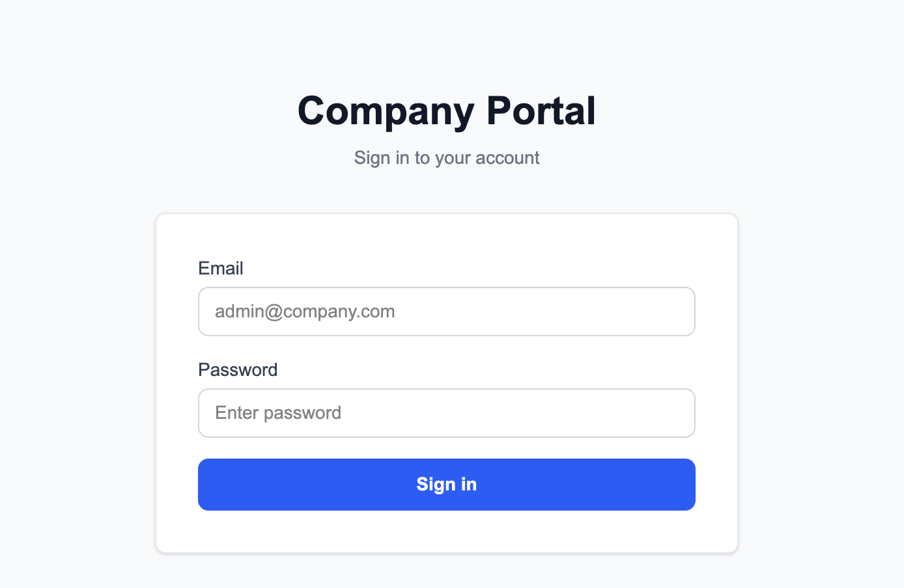
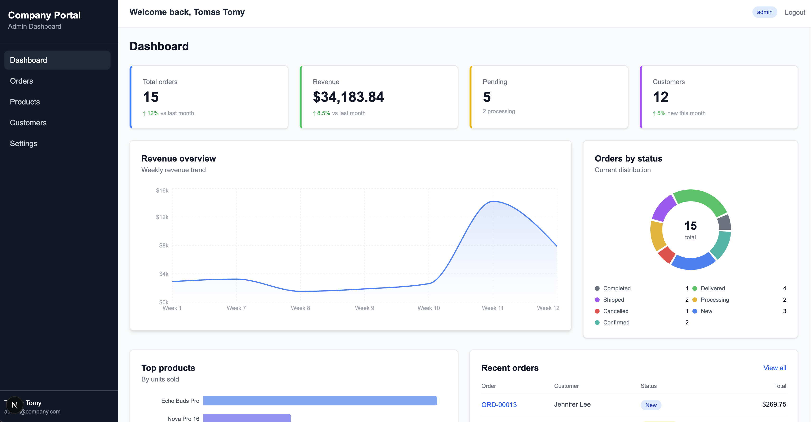
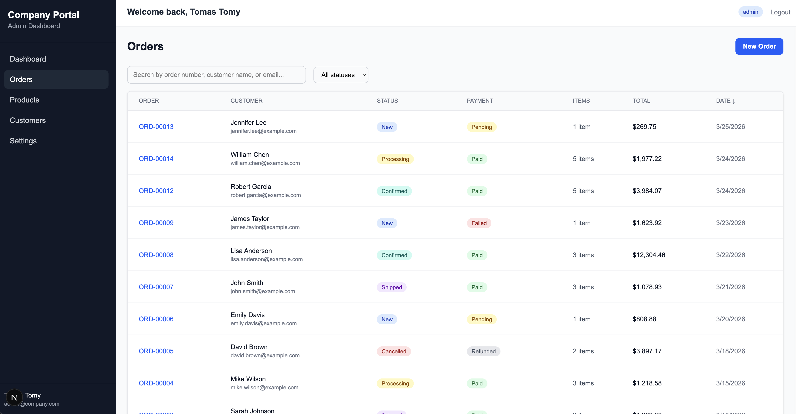
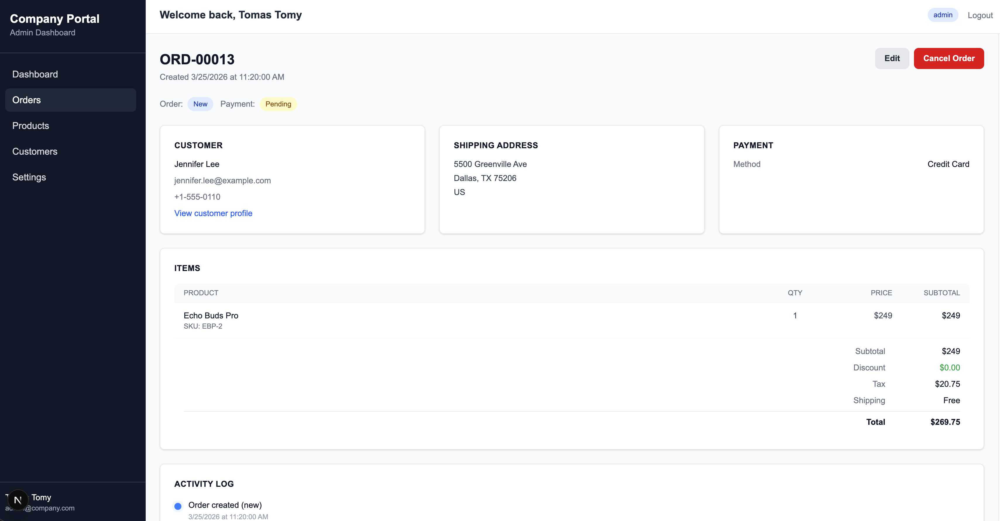
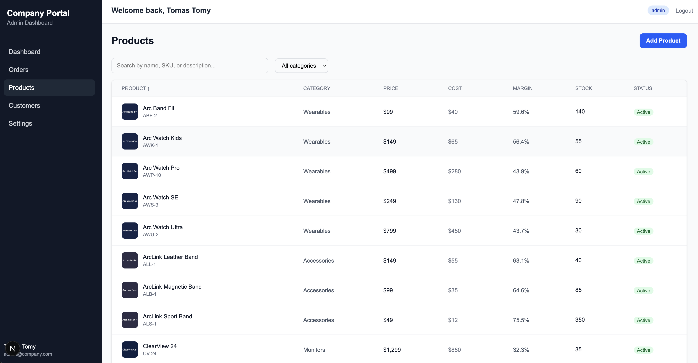
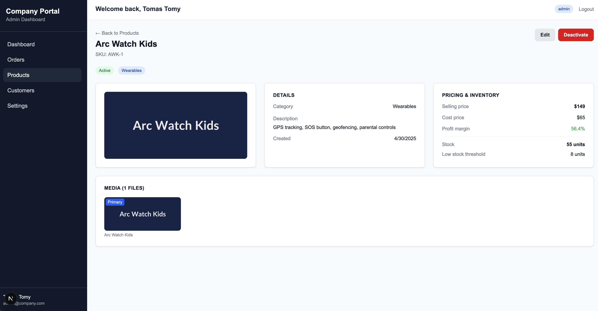
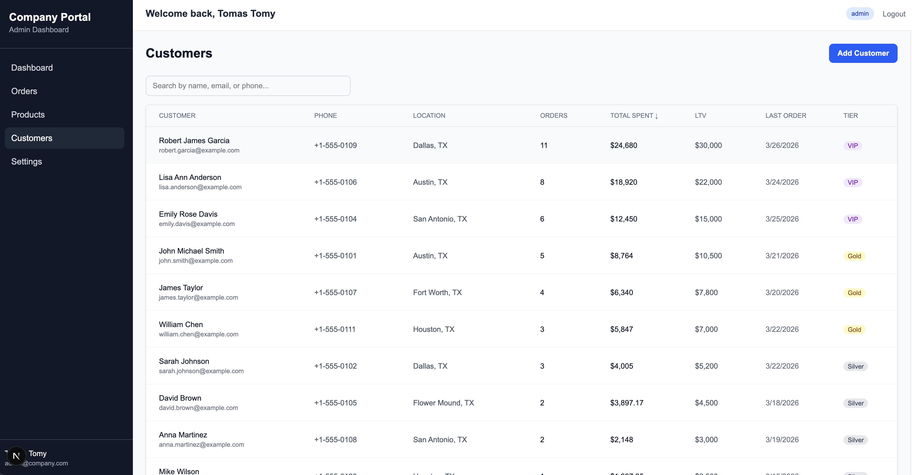
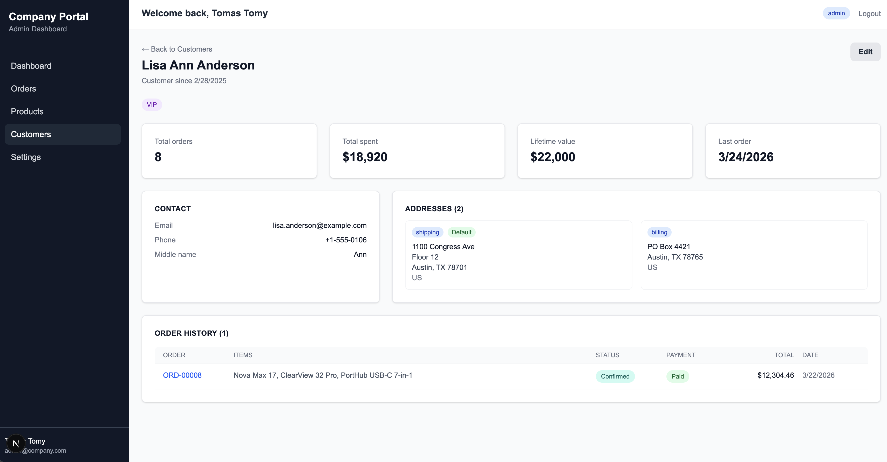

# Backoffice Dashboard

Part of the **Open Commerce Platform** — a full-stack e-commerce system. This is the internal admin panel where operators manage orders, products, and customers.

Built with Next.js 16, React 19, and TypeScript in strict mode. Designed around the repository pattern so the data layer can be swapped from mock data to a real database without touching any UI or business logic code.

## Tech Stack

| Layer     | Technology                                     |
| --------- | ---------------------------------------------- |
| Framework | Next.js 16.2 (App Router, Turbopack)           |
| UI        | React 19, Tailwind CSS 4                       |
| Tables    | TanStack Table v8                              |
| Charts    | Recharts 3                                     |
| Auth      | JWT + bcrypt, httpOnly cookies                 |
| Database  | MongoDB via Prisma 7 (mock data layer for now) |
| Language  | TypeScript 5 (strict mode, no `any`)           |

## Screenshots

### Login



### Dashboard

Overview with revenue chart, order status distribution, top-selling products, recent orders, and low stock alerts. Each section streams independently via React Suspense.



### Orders

List with status filtering, search, sorting. Detail page shows customer info, shipping address, payment, line items with totals, and a full activity timeline.

| List                                        | Detail                                             |
| ------------------------------------------- | -------------------------------------------------- |
|  |  |

### Products

Catalog with image thumbnails, pricing, profit margins, stock levels. Category filtering. Detail page includes media gallery and inventory alerts.

| List                                            | Detail                                                 |
| ----------------------------------------------- | ------------------------------------------------------ |
|  |  |

### Customers

Directory with tier classification (VIP/Gold/Silver/Bronze), lifetime value tracking. Detail page shows addresses, contact info, and full order history.

| List                                              | Detail                                                   |
| ------------------------------------------------- | -------------------------------------------------------- |
|  |  |

## Running the App

### Quick Start

```bash
npm install
npm run dev
```

Open [http://localhost:3000](http://localhost:3000). No database setup needed.

### Demo Credentials

| Role    | Email               | Password   |
| ------- | ------------------- | ---------- |
| Admin   | admin@company.com   | admin123   |
| Manager | manager@company.com | manager123 |
| Support | support@company.com | support123 |

### Environment

Copy `.env.example` to `.env`:

```bash
cp .env.example .env
```

| Variable       | Description                                                                         |
| -------------- | ----------------------------------------------------------------------------------- |
| `APP_PROFILE`  | `local` / `dev` / `qa` / `prod` — controls mock data, debug tools, demo credentials |
| `JWT_SECRET`   | Secret key for JWT token signing                                                    |
| `DATABASE_URL` | MongoDB connection string (not needed in `local` mode)                              |

### Data Modes

| Profile               | Data Source         | Notes                                                         |
| --------------------- | ------------------- | ------------------------------------------------------------- |
| `local`               | In-memory mock data | Default. 58 products, 15 orders, 12 customers. No DB required |
| `dev` / `qa` / `prod` | MongoDB via Prisma  | Requires `DATABASE_URL`. Schema and migrations coming soon    |

The app is built around the **repository pattern** — all data access goes through interfaces. In `local` mode, mock implementations serve data from in-memory arrays. When MongoDB is connected, only the repository implementations change. Pages, components, and services stay untouched.

## Architecture

```
src/
├── app/                        # Next.js App Router
│   ├── (auth)/login/           # Login page (standalone, no sidebar)
│   ├── (backoffice)/           # All authenticated routes
│   │   ├── dashboard/          # Metrics + charts (Suspense streaming)
│   │   │   └── _sections/      # Async server components per section
│   │   ├── orders/             # List + [id] detail
│   │   ├── products/           # List + [id] detail
│   │   └── customers/          # List + [id] detail
│   ├── not-found.tsx           # Global 404
│   └── layout.tsx              # Root HTML shell
│
├── components/
│   ├── ui/                     # Primitives: Button, Card, Badge, DataTable, Input, PageHeader
│   ├── layout/                 # Sidebar, Header, NavLinks
│   ├── dashboard/              # MetricCard, RevenueChart, OrdersByStatusChart, TopProductsChart
│   ├── orders/                 # OrdersTable, OrderTimeline
│   ├── products/               # ProductsTable
│   ├── customers/              # CustomersTable
│   └── auth/                   # LoginForm
│
├── lib/
│   ├── auth/                   # JWT creation/verification, login/logout, getCurrentUser
│   ├── services/               # Business logic: dashboardService, orderService, productService, customerService
│   ├── repositories/           # Data access layer
│   │   ├── interfaces.ts       # Repository contracts (OrderRepository, ProductRepository, etc.)
│   │   ├── types.ts            # QueryParams, PaginatedResult<T>
│   │   └── mock/               # Mock implementations + fixture data
│   ├── formatters.ts           # Currency, date, percent display formatting
│   ├── config.ts               # Environment profile config
│   └── routes.ts               # Centralized route constants
│
├── types/                      # Domain types: Order, Product, Customer, Address, Event, enums
├── actions/                    # Server actions: loginAction, logoutAction
└── proxy.ts                    # Auth middleware (Next.js 16 proxy convention)
```

### Key Design Decisions

**Repository Pattern** — Pages call services, services call repositories, repositories return data. The interface is the contract. Swap `mock/orderRepository.ts` for a Prisma-backed implementation and nothing else changes.

**Server Components for Data Fetching** — All pages are async server components. Data is fetched on the server, HTML is streamed to the client. No `useEffect` + loading spinners.

**Suspense Streaming on Dashboard** — Each dashboard section (metrics, charts, tables) is an independent async component wrapped in `<Suspense>`. They resolve and render independently.

**URL-Driven Table State** — Sorting, filtering, search, and pagination are stored in URL search params via `useSearchParams`. Shareable, bookmarkable, works with browser back/forward.

**Discriminated Unions for Events** — Order activity log uses 14 typed event variants. TypeScript enforces exhaustive handling in `getEventTitle()` and `getEventDescription()`.

**Customer Snapshots** — Orders store a copy of customer data at purchase time. If the customer later changes their name or email, historical orders remain accurate.

**Centralized Formatting** — All currency (`$1,234`), date, and percentage display goes through `lib/formatters.ts`. One place to change locale behavior.
